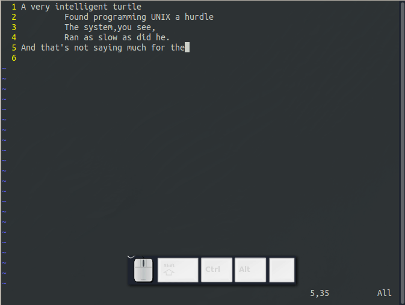

# 基本的编辑

Vim 是世界上最强大的文本编辑器之一，它的高效可以使你以最小的击键数编辑文件。这种能力和功能是有代价的：当开始使用时，你将面临以个陡峭的学习曲线。

本文我和大家分享在编辑文件时用的10个基本命令。本文包括一下内容：

- 四个基本的移动命令
- 如何插入和删除文本
- 如何获取帮助（很重要哦）
- 退出Vim

在你掌握这些命令后，就可以学习更高级的命令了。

## 在你开始之前

如果你还没有安装Vim，你应该首先安装[Vim](https://vim.en.softonic.com/).

如果你用的是Unix操作系统，你应该执行下面的命令：
```
$touch ~/.vimrc
```
创建一个~/.vimrc文件，即是告诉Vim你想在Vim模式下使用。如果这个文件不存在，Vim将会在Vi-compatibility模式下运行，并且你会失去很多Vim的高级功能。但是，你可以随时从内部启用Vim高级功能，用下面的命令：
```
:set nocompatible<Enter>
```

如果你用的是Windows操作系统，安装过程会自动创建此文件:_vimrc。

## 首次运行Vim

键入以下命令：
```
$vim file.txt
```
启动Vim。

需要注意的是，$是Unix默认的命令提示符。
如果你用的是Windows操作系统，打开MS-DOS终端窗口，键入命令：
```
C:>vim file.txt
```

无论以上哪种系统，Vim开始编辑文件名为file.txt文件。因为这是一个新文件，你会得到一个空白的窗口。如图1.1所示。


有~的行，表示文件中没有行，换句话说，当Vim新建一个文件时，它会显示~行，并在文件底部显示一条信息指示一个新文件，名为file。

### vim命令

如果你在终端中键入
```
$vim
```

Vim会创建一个临时文件，窗口中的信息也是临时的，当你键入第一个字符时，这是信息会消失。如图1.2所示。


### 模式

Vim编辑器是基于模式的。也就是说不同模式下，会有不同的行为。如果窗口底部显示文件名或空白，则说明你是在普通模式下；如果处于插入模式，窗口底端会显示-- INSERT --；如果处于视图模式，窗口底端会显示-- VISUAL --。


## 首次编辑

如何编辑我的第一个文件？学完这节，你将学到一些基本的编辑命令，并掌握如何进行基本的编辑，速度不快，但是能完成你的任务。俗话说，不怕慢，就怕站。

### 插入文本

要插入文字，你需要切换到插入模式。敲击i，要注意窗口左下方的提示信息：-- INSERT --（出现此信息，说明已处于插入模式了）。

随便键入一些文字，中文、英文等都可以,不用担心会犯错；

以下面的程序员打油诗为例：
```
A very intelligent turtle
         Found programming UNIX a hurdle
         The system,you see,
         Ran as slow as did he.
And that's not saying much for the turtle.
```

完成之后，按ESC退出插入模式，窗口左下角的-- INSERT --提示会消失，Vim就回到了普通模式。如下图所示：



### 摆脱困境

对于新手来说，其中的一个问题是模式混淆，这是由你所出的模式或键入切换模式的命令所引起的。要返回正常的模式，无论什么情况下，请按ESC键。

### 四处移动

回到命令模式后，你可以用以下键四处移动你的光标：h(向左),j(向下),k(向上),l(向右)。起初，这些命令可能是随机选择的。毕竟，谁听说过将j用做向右键？但实际上，这些选择有一个很好的理由：在编辑器中，移动光标是最常见的操作，这些键位位于你右手的基本键位上，这些命令放在你可以最快键入它们的位置。

当然，你也可以使用箭头来移动光标的位置。但是，如果你这样做，你的编辑速度会非常慢，因为要按箭头键，你必须将手从文本键区域移动到箭头区域，因为你可能以一小时要执行数百次移动，这可能需要大量的时间。如果你想有效的编辑，请使用h,j,k,l。


