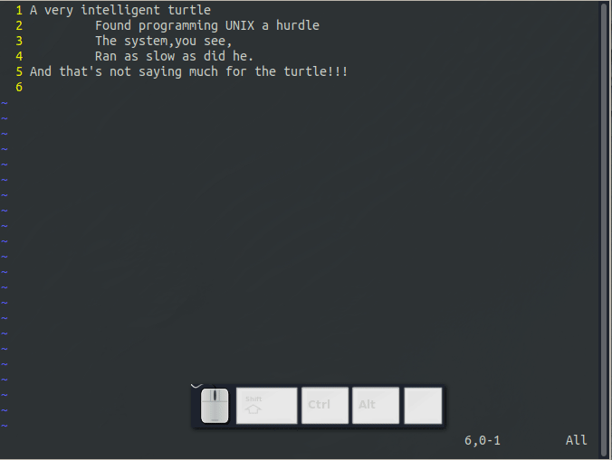
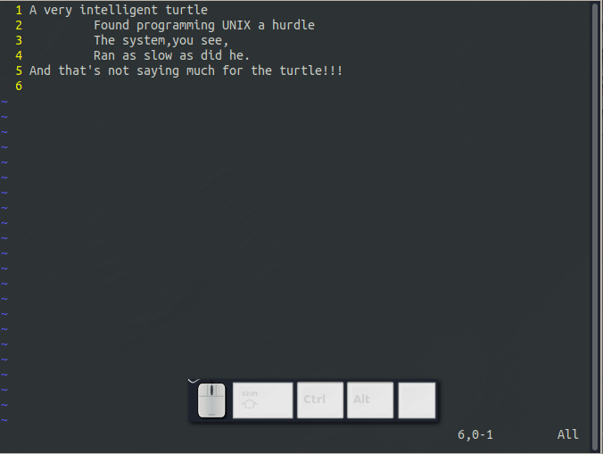

## 帮助

在本文最后，我们还要分享一个更重要的帮助命令，在Vim中获取帮助，可以键入：
```
:help
```
会出现如图1.10所示界面：



如果你不指定一个具体的帮助主题，:help会给你呈现一个普通的窗口。Vim开发者对帮助系统做了很聪明的事。他们把帮助窗口当做一个普通的编辑窗口。你可以用普通模式下所有的命令如h,j,k,l等浏览帮助信息。

退出帮助系统，你同样可以使用退出文件命令:ZZ。


当阅读帮助文档时，你会注意到有一些文本是被一对竖线包起来的，这说明此文本是超链接文本，你可以将光标移动到此竖线包括的文本的任何位置，然后按Ctrl+](转到标签)，跳转到标签所在的位置。跳转了几次后，如果你想返回之前的屏幕，Ctrl+T(返回标签)可以带你到之前的屏幕。

技术上，Vim使用tag来处理超链接的。在帮助屏幕的左上角有一个“*help.txt*"，这是用来定义一个标签用的。

要获取给定的帮助主题，请输入以下命令：
```
:help 主题 
```
例如，要获取命令x的帮助文档，就可以输入：
```
:help x
```
要想知道怎么删除文本，使用以下命令：
```
:help deleting
```
要想获取所有帮助主题的索引，使用下面的命令：
```
:help index
```
获取组合键命令，如Ctrl+A,使用如下命令：
```
:help ctrl-a
```

若要指定其它模式，使用模式前缀。
例如，查看插入模式下Ctrl+H命令的帮助，要用的模式前缀是：i_。 
```
:help i_ctrl-h
```



下表列出了各种模式下的前缀

```
        WHAT                        PREPEND     EXAMPLE      
        Normal mode command                     :help x
        Visual mode command         v_          :help v_u
        Insert mode command         i_          :help i_<Esc>
        Command-line command        :           :help :quit
        Command-line editing        c_          :help c_<Del>
        Vim command argument        -           :help -r
        Option                      '           :help 'textwidth'
        Regular expression          /           :help /[

```
编辑时，你可以使用命令行选项，选项都以短横线-开头。例如，查看命令行-t的帮助文档，命令如下：
```
:help -t
```

Vim有很多你可以自定义的数字选项，如果你要查找有关数字选项的帮助，使用如下命令：
```
:help 'number'
```

去查看功能键的帮助文档，你需要使用箭头包含它们：
```
:help <up>
```
### 其它获取帮助的方法

按F1键也可以查看帮助。

