# 编辑快一点

在[基本编辑](chpt01/Chpt01.md)文章中，我介绍了Vim的基本命令，使你能够编辑文本，在这篇文章中，我将介绍一些可以提高编辑效率的命令及技巧。主要包括以下内容：

- 附加移动命令
- 行内快速搜索
- 其它删除和修改命令
- 重复命令
- 宏命令(录制宏和回放宏)
- 连字符

Vim中有很多不同操作方法，本文将讨论众多选择中较为有用的方法。

## 单词移动

- w 前移一个单词，光标停在下一个单词开头；
- b 后移一个单词，光标停在上一个单词开头；
- W 移动到下一个单词开头，但忽略一些标点；
- B 移动到上一个单词开头，但忽略一些标点；
- e 前移一个单词，光标停在下一个单词末尾；
- E 移动到下一个单词末尾，如果词尾有标点，则移动到标点；

就我个人而言，我平时用的最多的就是w和b，也经常会在前面加上数字前缀。例如，2b向后移动两个单词，如图2.1所示：

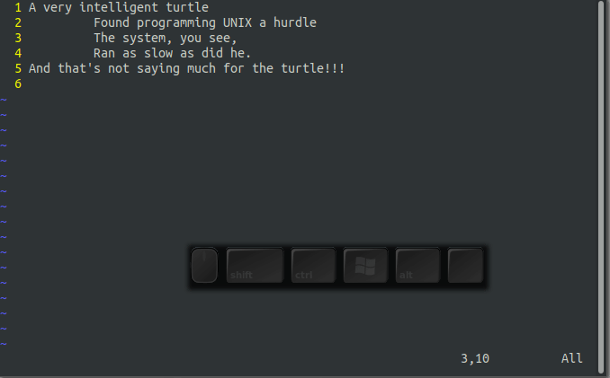

## 移动到行首或行尾

- $ 将光标移动到行尾;
- 0或HOME键 将光标移动到行首;
- ^ 将光标移动到本行第一个非空白字符处；

上面的3个命令也可以加数字前缀。例如，2$将光标移动到下一行行尾，如图2.2所示：

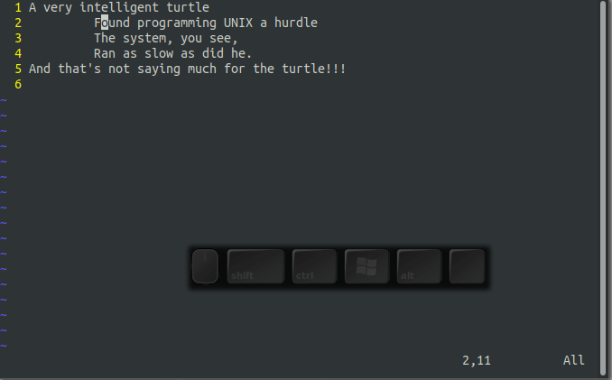

## 行内搜索

- fs 将光标移动同一行的下一个s字符处
- Fs 将光标移动到同一行上一个s字符处
- ts 把光标移动到同一行下一个s字符处前
- Ts 把光标移动到同一行的上一个s字符后


移动是最常见的编辑操作，其中最有用的就是单字符搜索命令。如fs在本行内向前搜索字符s，Fs在本行内向左搜索字符s,如图2.3所示：

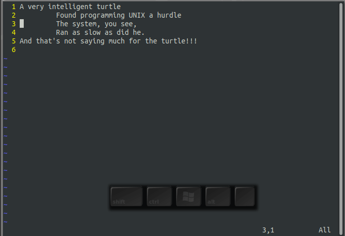

ts命令和fs命令类似，但是它是将光标停在字符s前，将光标停在字符s后的命令是Ts，演示如图2.4所示：

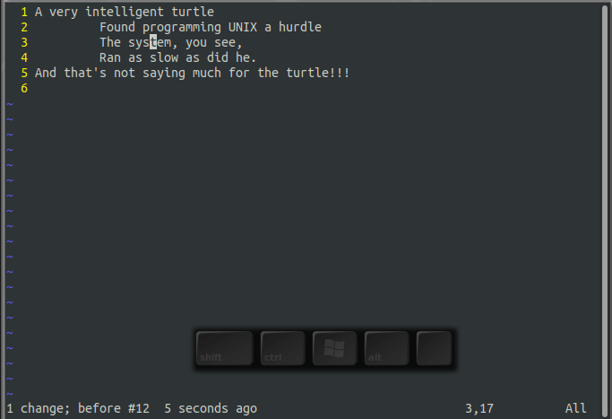

命令;和，常常配合上述命令使用。其中;命令是用于重复上一次搜索，逗号,命令用于反向重复上一次搜索。

## 你在文件中的位置

你怎么知道你处在文件中的什么位置？有很多种方法。其中之一就是用下面的命令打开行号显示:
```
:set number
```

关闭行号显示，用如下命令,如图2.5所示：
```
:set nonumber
```

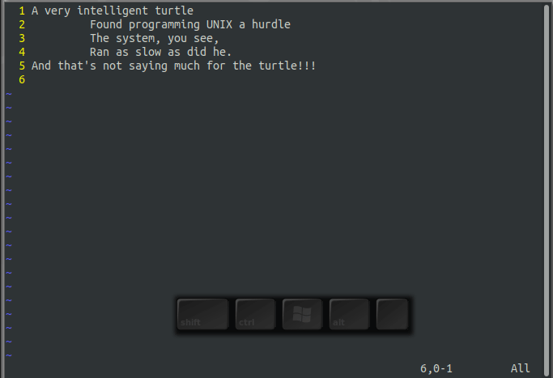

### 我在哪？

Ctrl-G命令显示一行状态信息，用于说明你当在的位置。比如：

“c2.txt”120L,2642C written 72,10-8    53%

这一行状态信息表示你正在编辑一个名为c2.txt的文件，并且该文件共120行，2642个字符被保存起来了，当前光标所处的位置在第72行，第8个字符，整个文件53%处。

## 移动到指定的行

加入你是个C或C++程序员，例如下面的错误提示，你应该不陌生：

prog.c:3:'j'undelared(first use in this function)

这一行信息告诉你可能需要修改第3行的代码，但是你怎么定位到第3行呢？

也许你可以先9999k回到首行，然后2j跳转到第3行。这不是好办法，但是可行的。

一个更好的办法是使用G命令。3G就可以快速定位到第3行。

单独的一个G会带你到文件的末尾。

## 删除文本

在文章[看完这篇，你就可以用Vim干活了](https://zhuanlan.zhihu.com/p/141955016)里，我介绍了dd命令，它可以删除一整行。dw命令删除一个单词。事实上，d的语法格式是：

```
d motion
```

比如，3w是将光标前移3个单词,d3w命令删除3个单词。如图2.8动画演示：

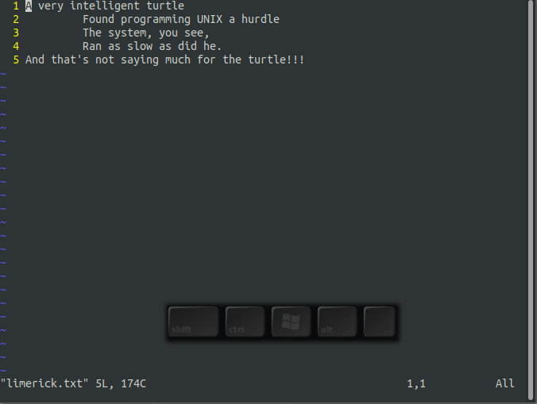

$命令是将光标移动到行尾。d$删除光标从当前位置（不包含）到行尾的所有字符。如图2.9动画所示：

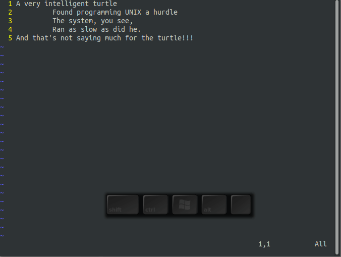


## 把数字放在哪呢？(3dw or d3w)

3dw和d3w都是删除3个单词。如果你想较真，搞清楚它们的不同。我要告诉你的是，3dw命令删除一个单词三次；d3w一次删除3个单词。这就是它们的区别。

你也可以加入两个数字进来。比如3d2w命令删除2个单词，并执行3次。

## 改变文本

命令c可以改变文本。和d命令很相似，但是它会切换至插入模式。比如，cw删除一个单词，并转入插入模式，如图2.10动画演示：

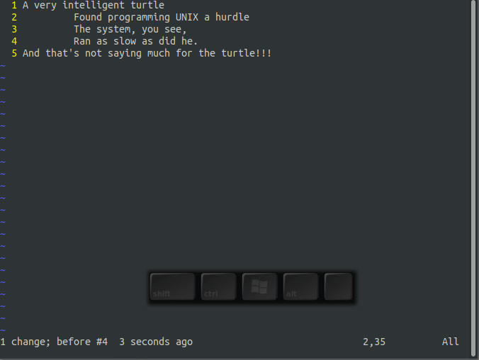

俗话说，每个问题都有一个简单，清晰和错误的答案。cw命令的示例就是这种情况。cmotion命令与dmotion命令一样，但有一个例外：cw 和dw命令。而cw则将文本删除到单词后面的空格（然后进入插入模式），dw命令删除该单词及其后的空格。

cc命令适用于整行，即删除该行然后执行进入插入模式。 换句话说，cc与dd一样在当前行上工作。 同样c$或C从光标更改到行尾。

## .命令

.命令是Vim中最简单但功能最强大的命令之一。 重复一遍最后的删除或更改命令。例如，假设您正在编辑HTML文件并要删除所有<a>标记。将光标放在第一个<,使用命令df>删除<a>。然后转到下一个</a>的<,使用.命令删除它。.命令执行最后一个更改命令（在此例中，即df>）。要删除其他标签，请将光标放在<上并按.命令。看图2.11动画演示:

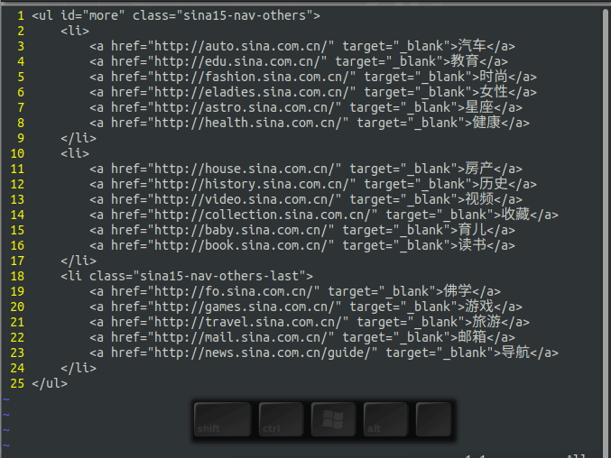

### 合并行

J命令将当前行与下一行合并,在末尾添加一个空格,将第一行的第二行分开。如果指定了计数，则将计数行连接起来（最少两个）,并在每行连接处用空格隔开。如图2.12动画演示：

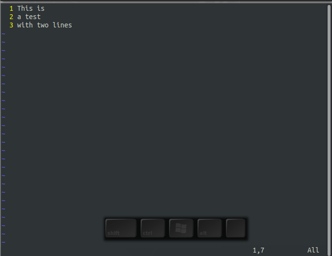

## 替换字符

rx命令用x替换光标下的字符。例如,图2.13动画演示如何使用r命令将0替换为1。

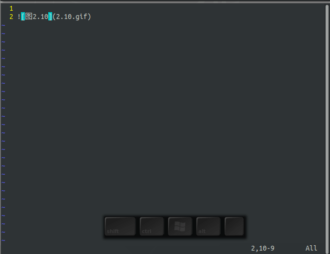

r命令前面可以有一个计数，指示要替换的字符数。 在图2.14中，我们yy复制第2行，p粘贴到下一行，光标定位至第一个1上，并执行2r1将10替换为11。替换第二个10时，执行.命令，重复上次更改。

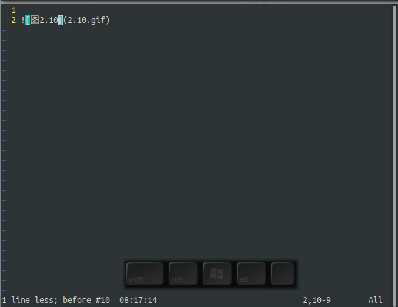

### 注意

r命令以特殊方式对待<Enter>。无论计数多大，只有一个<Enter> 已插入。因此，5ra插入五个a字符，而5r <Enter>则用一个1替换五个字符。

请小心放置计数。5rx命令将五个字符替换为字符x，而r5x用5（r5）将光标下方的字符替换为,然后删除一个字符（x）。

## 变换大小写

~命令更改字母的大小写。它将大写更改为小写，反之亦然。如果指定了计数，则更改计数字符。图2.15动画演示：


## 键盘宏

.命令重复前面的更改。但是，如果您想做比单一更改更复杂的事，怎么办？这就是键盘宏存在的意义。qcharacter命令将击键记录到名为character的寄存器中。字符必须在a和z之间。）

要完成录制，只需键入q命令。您现在可以通过以下方式执行宏：键入@character命令。 （这之前可以先进行计数，这将导致宏执行的相应的次数。）

看一下如何在实践中使用这些命令。您有一个文件名夹列表,看起来像这样：
C321

C323

C219

C217

而您想要的是以下内容：

<td><a href="/C321/readme.md">321</a></td>

<td><a href="/C323/readme.md">323</a></td>

<td><a href="/C219/readme.md">219</a></td>

<td><a href="/C217/readme.md">217</a></td>

那么，你应该一次执行以下命令：

qa 开始注册名为a的宏,并记录

0 移动光标至行首

i<td><a href="/<ESC> 插入字符“<td><a href="/"

lvll 前有移动光标至第一个数字3上,并进入Visual模式，选中321，并复制

i/readme.md"><ESC> 插入字符“/readme.md">” 并退出插入模式

p 粘贴字符321

</a></td><ESC>j 键入字符“</a></td>” ,退出插入模式，并转入下一行

q 停止记录宏


既然您已经完成了一次工作，则可以通过键入命令@a。另外，由于您还有二行内容，您可以更改它们 使用命令3@a。图2.16显示了如何定义然后执行宏:

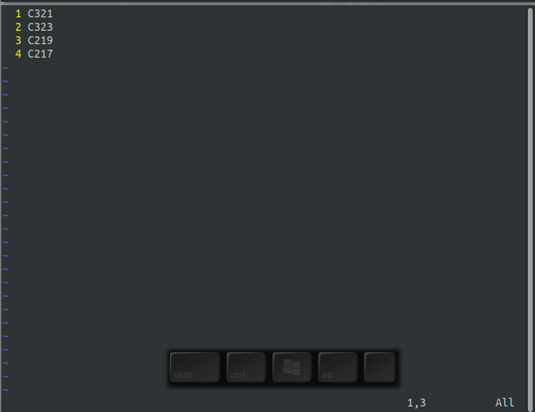

## 有向图

有些字符键盘上没有，你可以使用Vim里的有向图(见下表digraph-table(部分))来键入这些字符，在有向图里，两个字符代表一个字符。

这里有两种输入方法：

- CTRL-K {char1} {char2} (推荐）

- {char1} <BS> {char2}

比如，这个版权字符@,在输入模式下，第一步按ctl-k，光标处会出现？，这是再输入两个字符A和t即可。详见图动画演示：


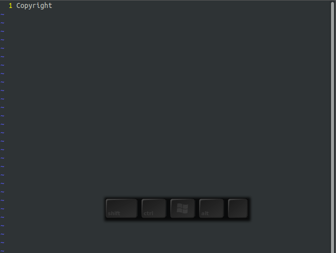


                                                        *digraph-table*
char  digraph   hex     dec     official name ~

^@      NU      0x00      0     NULL (NUL)

^A      SH      0x01      1     START OF HEADING (SOH)

^B      SX      0x02      2     START OF TEXT (STX)

^C      EX      0x03      3     END OF TEXT (ETX)

^D      ET      0x04      4     END OF TRANSMISSION (EOT)

^E      EQ      0x05      5     ENQUIRY (ENQ)

^F      AK      0x06      6     ACKNOWLEDGE (ACK)

^G      BL      0x07      7     BELL (BEL)

^H      BS      0x08      8     BACKSPACE (BS)

^I      HT      0x09      9     CHARACTER TABULATION (HT)

^@      LF      0x0a     10     LINE FEED (LF)

^K      VT      0x0b     11     LINE TABULATION (VT)

……

@       At      0x40     64     COMMERCIAL AT

……


