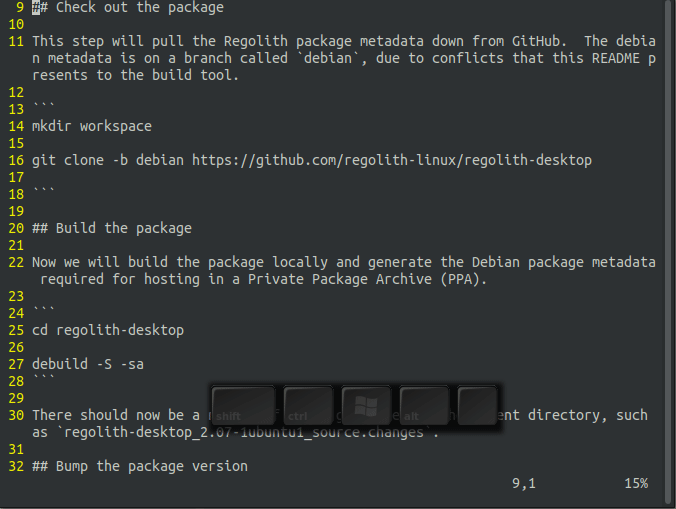
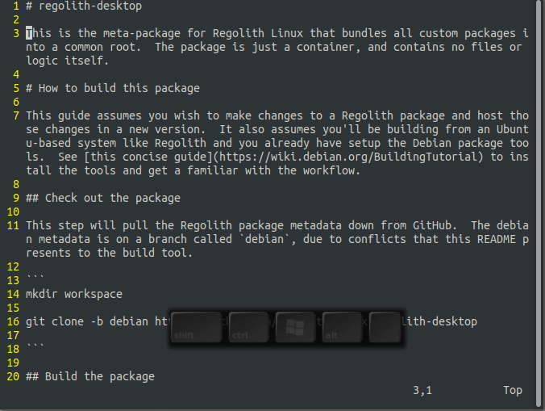

# Vim 翻屏操作

在这篇文章里，我将和大家分享有关Vim翻屏的各种操作。其它的不多说，先来看看命令：

- ctrl-u 上翻半屏
- ctrl-d 下翻半屏
- ctrl-f 下翻一屏
- ctrl-b 上翻一屏

接下来，给大家动画演示，如图2.6所示：

还有一个命令zt，可以将当前行移动到屏幕顶端，举个例子，如要将下面第10行移动的屏幕顶端，首先将光标定位至第10行，然后zt即可，看图2.7演示：

这个经常用来对比source。

今天分享了翻屏的一些常用操作，不要忘记动手练习哦。如果你有更多实用的Vim操作技巧，欢迎留言或来稿！

你的点赞，留言，打赏是我写作分享的最大动力！
