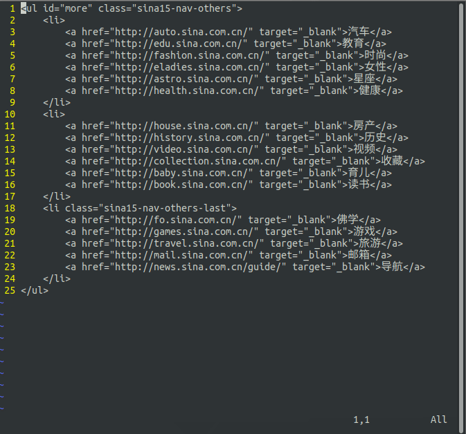
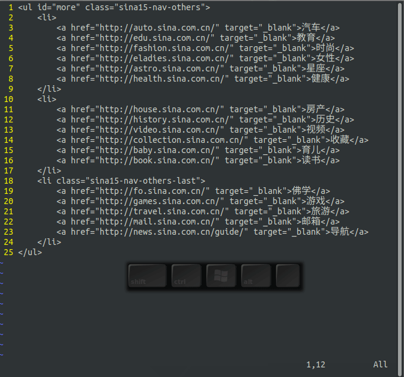
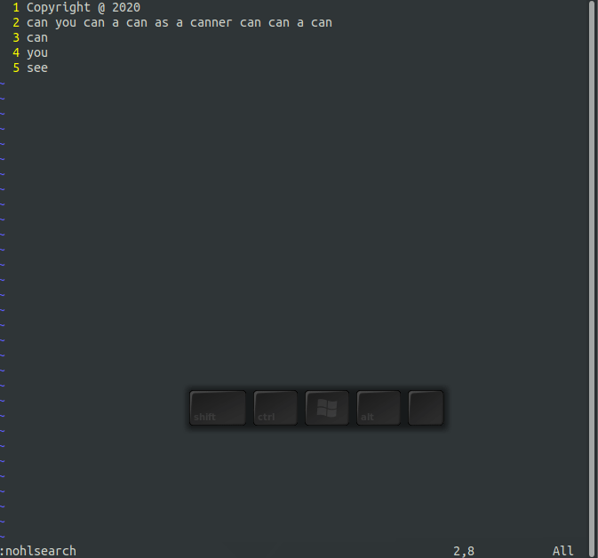
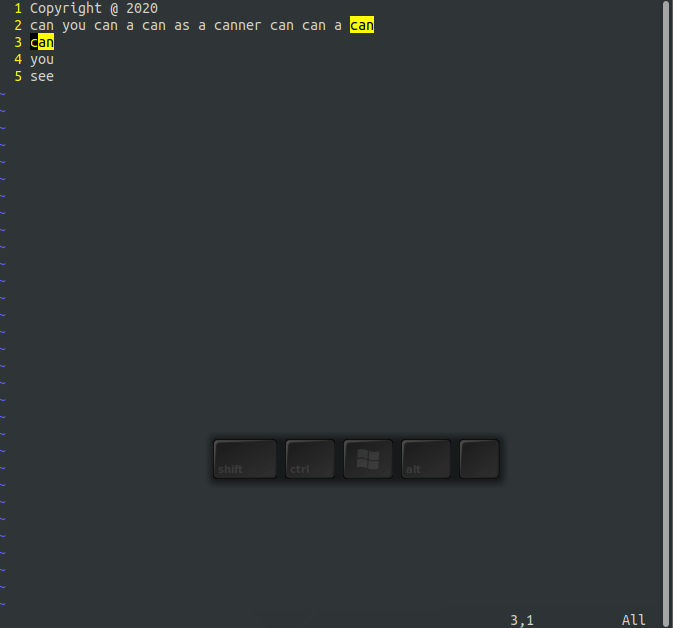
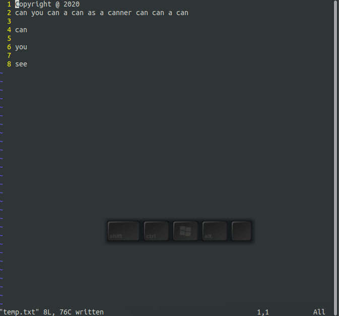
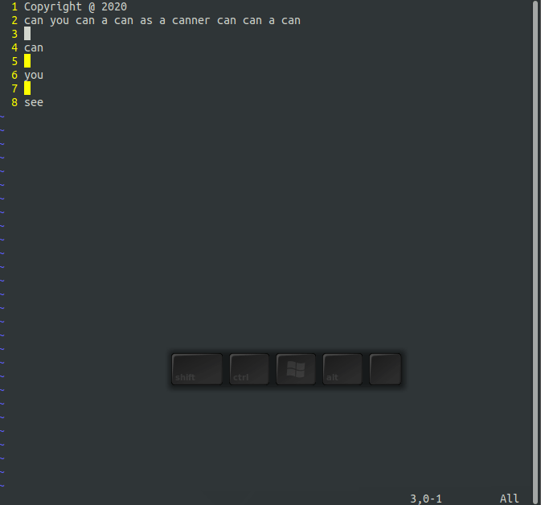
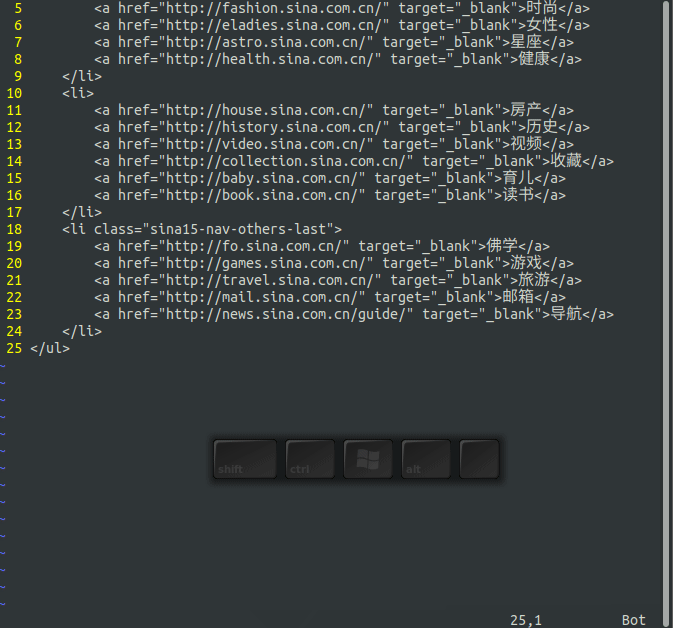

这一章里，我将介绍各种Vim搜索命令。Vim里基本的搜索命令超级简单，看完这篇文章，你就可以开心的搜索了。

接下来，我将分享以下内容：

- 简单的单词搜索
- 搜索选项
- 渐进式搜索
- 改变搜索方向
- 基本的正则表达式

## 简单搜索
搜索一个字符用/命令。比如，要搜索href,键入/href,然后Enter。光标会移动到字符h上。如图3.1动画演示：



搜索下一个href，使用/<Enter>命令或者n命令，后者少一次击键。如图3.2动画演示：



/<Enter>和n命令前都可以加上计数，如2/<Enter>或2n表示向下搜索2次，如图3.3动画演示：


### 搜索历史
搜索命令有记录历史的特征。假如，你执行过以下搜索：

/one

/two

/three

现在，输入/命令，不要按<Enter>键，用<UP>键和<DOWN>键上下翻阅，确定要再次搜索,按<Enter>即可。

## 搜索选项

有很多搜索选项来控制搜索结果，下面就来讨论。

### 高亮

下面的命令可以是Vim高亮显示搜索到的结果：
```
:set hlsearch
```
如何打开搜索高亮显示，比如搜索href字符，那么href将会高亮显示，如图3.4.gif动画演示：


关闭搜索高亮用以下命令即可：
```
:set nohlsearch
```

关闭当前搜索结果高亮，用下面的命令：
```
:nohlsearch
```
不用担心，你执行下一次搜索时，高亮还会再次出现的。

### 渐进式搜索

默认情况下，Vim使用普通搜索方式搜索，即你输入特定字符，然后Vim执行搜索。如果你执行以下命令：
```
:set incsearch
```
Vim则执行渐进式搜索（或称递进式搜索）。

如图3.5动画演示，搜索href。


关闭渐进式搜索，执行以下命令：
```
:set noincsearch
```

## 向上搜索
?命令反向搜索。?something命令用来向上搜索something。如果最后使用的是?搜索文本，执行重复上一次搜索命令n,也会向上搜索。

如图3.6动画演示，?和n配合使用的情况：


## 改变方向
假设你使用/href向下搜索，若要反向向上搜索可执行?命令。n命令在上一次方向上重复上一次搜索；N命令翻转方向重复一次搜索。

为了让你更直观的理解/、?、n和N命令的执行效果，下面的以搜索文档中的href为例：
- 第一步 执行/href 向下搜索href
- 第二步 执行?<Enter>,改变搜索方向，向上搜索href
- 第三步 执行n重复上一次搜索
- 第四步 执行N，反向重复搜索

详见图3.7动画演示：


## 基本的正则表达式
正则表达式在搜索中有着重要的作用。正则表达式是专门用于描述搜索中的（Pattern）的。使用正则表达式来构建pattern可以让搜索更加强大和精准。

让我们从简单的开始。在正则表达式中，一类即基本字符，仅匹配它自身，如“href”，只能匹配“href”。

第二类，即是具有特殊意义的元字符。不像基本字符，元字符具有特殊意义。如下一节将要讲到的^和$分别可以匹配行首和行尾。

### 匹配行首(^)和行尾($)

- ^can 仅匹配行首can，也即必须以模式开头
- can$ 仅匹配行尾can，也即必须以模式结尾

看图3.8动画演示：



如果你想搜索只有字符can的行，使用/^can$命令。如图3.9动画演示：



如果你想搜索空行，使用/^$。如图3.10动画演示：



### 匹配任何单个字符(.)

字符. 用于匹配任何单个字符（除换行符）。例如，表达式a.匹配所有包含a，并且第二个可以是任意一个字符的字符串。如图3.11动画演示：




### 匹配特殊字符

很多特殊字符在正在表达式里有特殊的含义。为了搜索这些字符你需要在它们前面加上\。比如搜索com.cn,使用com\.cn即可。如图3.12动画演示：




## 正则表达式总结
下面的列表列出了部分Vim对正则表达式支持的通用匹配符：

- . 匹配任何除换行符以外的单个字符
- ^ 匹配行首
- $ 匹配行尾
- \character 匹配特殊字符


